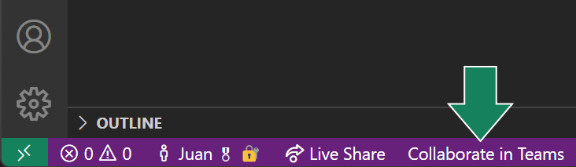
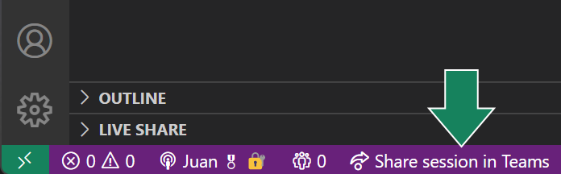
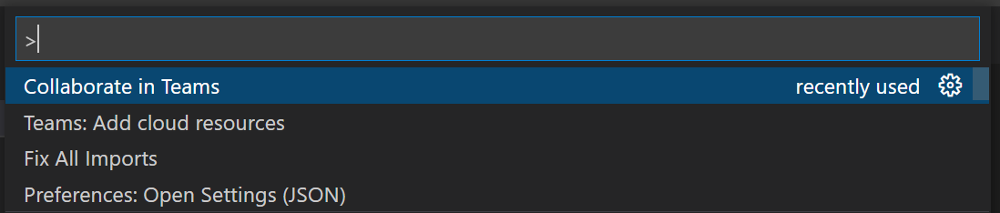

# MS Teams Live Share Extension

This extension allows you to bring a Live Share session into a Teams meeting

## Features

This extension allows you to easily bring a Live Share session into a Teams meeting. To accomplish this you have a couple of options.

The simplest is to click the button in the status bar to collaborate in teams

If you already have a Live Share session going, you can also bring the session into a Teams meeting.

Finally, there is a command available to accomplish the same:

## Requirements

You need to be able to perform a Live Share session.

Also, you need to allow attendees in the Teams meeting to join your session from VSCode.

## Extension Settings

None at this point

## Known Issues

None at this point

## Release Notes

None at this point

### 1.0.0

Initial release
